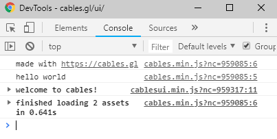

# General op/Port Callbacks

In order to get informed on port-value-changes, function-triggers (also see [Ports](../dev_creating_ports/dev_creating_ports)) or general op-events there are a number of callbacks your op can implement.

To be  informed of port-value-changes, function-triggers (also see [Ports](../dev_creating_ports/dev_creating_ports)) or general op-events there are a number of callbacks your op can implement.

*Tip: It’s always a good idea to inspect the code of existing ops by selecting an op and then pressing `view code` in the op-settings on the right.*<br>


*Shortcut - click on an op and press the 'e' key*
<br>
## Port Callbacks

### onChange

Can be implemented for the following port types:

**Value
String
Boolean
Array
Object**

Every time a connected op calls the `myOutPort.set(...)` method, the in-port-callback `onChange` is called.

```javascript
myPort.onChange = function()
{
  op.log('value of myPort changed to: ', myPort.get());
};
```

### onTrigger

Can be implemented for the port type **trigger**.

Every time a connected op calls `myInputPort.onTriggered()` the connected in-ports’ `onTrigger` callback is called.

If your op needs to update its values continuously it should have an input port of type **trigger** , which you can then connect to the [MainLoop](https://cables.gl/op/Ops.Gl.MainLoop)


### onLinkChanged

Gets called whenever a port is connected / disconnected. It may not have a value yet.

```javascript
myPort.onLinkChanged = function()
{
	if( myPort.isLinked() )
	{
		// port connected
	}
	else
	{
		// port disconnected
	}
};
```
## General Op Callbacks

### init

In case you have some initialisation code which depends on the ports being set you can place it inside an `init` function. Here you can be sure that the input port is set correctly (when the user enters a value in the op parameters or when the port is connected to another op).

When you inspect existing ops by pressing the `View Code` button in the op parameters, you will notice that most ops don’t use this function. This is because most ops don’t depend on their input ports and can be initialised without the input ports being set.


```javascript
var inPort = op.inValueFloat('In Value');

op.init = function()
{
	var value = inPort.get();
    // your code which depends on inPort being set goes here
}
```

### onLoaded

Gets called when the whole patch is loaded / all ops are linked / all external libraries loaded etc. You normally won't need this as op-specific init-code can just be put in your op-code without a callback. `op.onLoaded` is **not** called when the patch has just been added to the patch, only when the patch is loaded, so it is better to use `init` (see on top).

```javascript
op.onLoaded = function()
{
	// do something
};
```
### onDelete

If your op needs to clean up after itself when it is deleted from the patch you can implement `onDelete`:

```javascript
op.onDelete( function()
{
	// do some manual cleanup here
});
```

### op.data

Sometimes you need to create variables inside your op and make them accessible globally. Every op has a `data`-object-property which can be used for this. Instead of writing:
```javascript
var myVar = 1;
```

you could then do:
```javascript
op.data.myVar = 1; // globally accessible if you have access to the op
```

In most cases you don’t need this, but there are some use cases where it is useful.

### op.setUiError
Sometimes you will want to create a UI element to show if there is an error or a warning when some condition occurs in the code for an op.

To do this use the following format:
```javascript
if(condition) op.setUiError("error ID/must be unique per error","Error message to show in UI",0);
//this resets the error message so it disappears
else op.setUiError("error ID",null);
```
The number in the last part of the function defines what kind of error is shown
0 - hint / grey color
1 - warning / orange color
2 - error / red color / this will also place a red dot on the right hand side of the op
<br>

<br>
example code to show an error:
```javascript
//create a port of the type boolean
const switch1=op.inBool("Error",false);
//if port changes run this function
switch1.onChange=function()
{
	if(switch1.get()) op.setUiError("error1","switch 1 is true",2);
    else op.setUiError("error1",null);
}
```
<br>


## Logging

To debug your ops you can press **ctrl+shift+i** (in chrome) to open the developer tools
The following line of of code will print 'hello world' to the console

```javascript
op.log( 'hello world' );
```
<br>


Do **not** use `console.log()`!

`op.log()` is not shown if the patch is embedded and the silent parameter is set, also you get a reference to the op which is producing the log-message in your browsers developer tools.
**Be aware that logging things too often in the console can slow down the browser, use this only for debugging and remove all op.log() code when you are done**

### canvas resize

Whenever the canvas is resized `onResize` gets called.

```javascript
op.patch.cgl.addEventListener("resize",onResize);

function onResize()
{
	// do something
}

```

